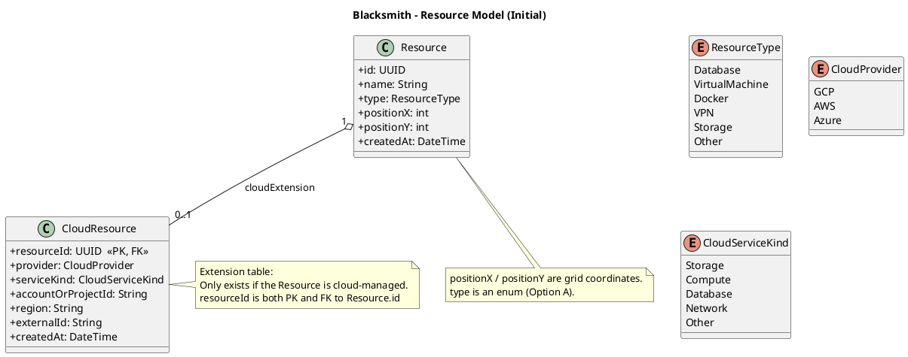

  # Blacksmith

A Proof of Concep(POC) to test building application with the game engine [GODOT](https://godotengine.org/fr/).

I'm using the package [godot_dart](https://github.com/fuzzybinary/godot_dart)

---

## 🎯 Project Context & Objectives

The main goals of this project are:

- Build an **interactive isometric grid** where resources can be placed dynamically
- Expose a **modular cloud backend API**
- Execute **real cloud operations** (currently: Google Cloud Storage bucket creation)
- Validate a **portable development workflow using devcontainers**

---

## 🧱 Global Architecture Overview

## 🐳 Devcontainers

Both frontend and backend are fully containerized using **VS Code devcontainers**:

### Frontend Devcontainer
- Dart SDK
- Godot integration
- GetIt / build_runner
- Portable across Linux / Windows / WSL / VM

### Backend Devcontainer
- .NET 8 SDK
- Google Cloud SDK
- Environment variables:
  - `ASPNETCORE_URLS`
  - `GOOGLE_APPLICATION_CREDENTIALS`
- Automatic dependency installation through `postCreateCommand`

This ensures:
- Identical environments across machines
- No local dependency pollution
- Easy onboarding for new contributors

